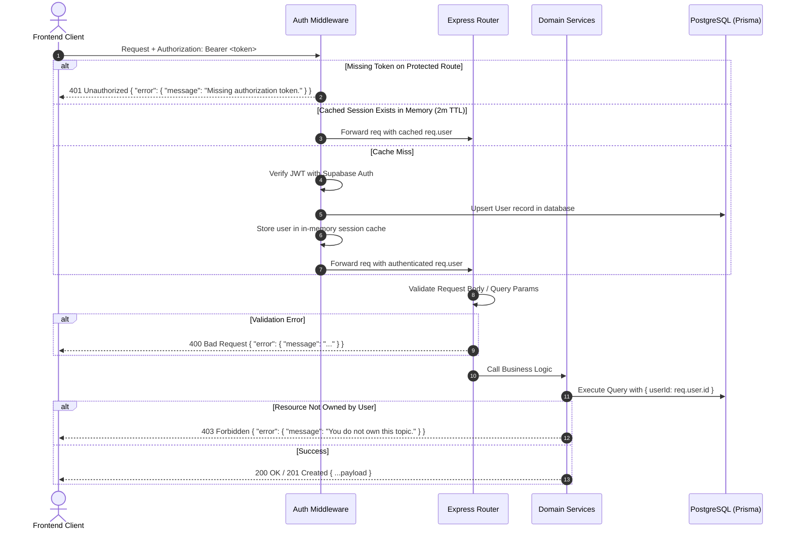

# Notice Me — REST API Reference

All requests to protected endpoints require a Supabase JWT Bearer token in the `Authorization` header:

```http
Authorization: Bearer <access_token>
Content-Type: application/json
```

Base URL: `http://localhost:3000` (or configured production API origin).

---

## API Request Lifecycle Flow



---

## 1. System & Health

### `GET /health`
Returns system health, server uptime, and scheduler heartbeat status.

- **Access:** Public
- **Response:** `200 OK` (Healthy) or `503 Service Unavailable` (Degraded)

```json
{
  "status": "ok",
  "service": "Notice Me API",
  "uptimeSec": 450,
  "timestamp": "2026-10-09T11:00:00.000Z",
  "scheduler": {
    "running": true,
    "startedAt": "2026-10-09T10:52:30.000Z",
    "lastHeartbeatAt": "2026-10-09T11:00:00.000Z",
    "healthy": true,
    "tasks": {
      "prefetch": "50 * * * *",
      "dispatch": "0 * * * *",
      "trendingRadar": "45 7,13,19 * * *",
      "initialTicker": "* * * * *"
    }
  }
}
```

---

## 2. Trending Public Notices

### `GET /api/topics/trending`
Returns curated and dynamically discovered public notices across India.

- **Access:** Public
- **Query Parameters:**
  - `refresh=true` *(optional)*: Forces a live re-crawl of SerpApi Google Trends India.
- **Headers Returned:** `Cache-Control: public, max-age=15`

```json
{
  "trending": [
    {
      "id": "trend-upsc-2026",
      "name": "UPSC CSE 2026",
      "query": "UPSC CSE 2026 prelims notification exam date upsc.gov.in",
      "category": "exam",
      "badge": "🔥 100K+ SEARCHES",
      "headline": "UPSC Civil Services Examination 2026 schedule notified on portal.",
      "officialSource": "upsc.gov.in",
      "followers": 12,
      "urgency": "HIGH",
      "isLive": true
    }
  ]
}
```

---

## 3. Topic Management

### `GET /api/topics`
Lists all monitored topics belonging to the authenticated user.

- **Access:** Authenticated
- **Response:** `200 OK`

```json
{
  "topics": [
    {
      "id": "topic-1",
      "name": "PM-KISAN Scheme",
      "query": "pm kisan installment date eligibility pmkisan.gov.in",
      "category": "scheme",
      "alertEmail": "user@example.com",
      "alertEnabled": true,
      "alertFrequency": "1d",
      "alertHour": 12,
      "alertDays": "weekdays",
      "timezone": "Asia/Kolkata",
      "lastAlertedAt": "2026-10-09T06:30:00.000Z",
      "createdAt": "2026-10-01T08:00:00.000Z"
    }
  ]
}
```

---

### `POST /api/topics`
Creates a new topic monitor. Free tier accounts are limited to 5 topics.

- **Access:** Authenticated
- **Request Body:**
```json
{
  "name": "GATE 2027",
  "query": "GATE 2027 application deadline eligibility gate.iitk.ac.in",
  "category": "exam",
  "alertEmail": "candidate@example.com",
  "alertEnabled": true,
  "alertFrequency": "3h"
}
```
- **Responses:**
  - `201 Created`: Returns `{ "topic": { ... } }`.
  - `400 Bad Request`: Invalid parameters or name/query missing.
  - `403 Forbidden`: Free account limit reached.
  - `409 Conflict`: Alerts enabled but SMTP is not configured.

---

### `GET /api/topics/item/:id`
Retrieves a single topic by ID with ownership verification.

- **Access:** Authenticated
- **Responses:** `200 OK`, `404 Not Found`, `403 Forbidden`.

---

### `DELETE /api/topics/:id`
Deletes a topic and cascades deletion across all its snapshots and diffs.

- **Access:** Authenticated
- **Responses:**
  - `204 No Content`: Topic deleted.
  - `409 Conflict`: Cannot delete while topic is actively syncing live data.

---

### `POST /api/topics/:id/sync`
Manually triggers a live SerpApi search, diff comparison, and AI briefing pull.

- **Access:** Authenticated
- **Rate Limit:** 10 manual syncs per minute per user; 60s cooldown between pulls per topic.
- **Response:** `200 OK`
```json
{
  "topic": { "id": "topic-1", "name": "PM-KISAN Scheme" },
  "snapshot": { "id": "snap-5", "pulledAt": "2026-10-09T11:20:00.000Z" },
  "diff": { "id": "diff-2", "summary": "..." },
  "isBaseline": false,
  "message": "New live changes detected and recorded!"
}
```

---

### `POST /api/topics/:id/alert-settings`
Updates email delivery preferences and notification schedules.

- **Access:** Authenticated
- **Request Body:**
```json
{
  "alertEmail": "alerts@example.com",
  "alertEnabled": true,
  "alertFrequency": "1d",
  "alertHour": 14,
  "alertDays": "all",
  "timezone": "Asia/Kolkata"
}
```
- **Frequency Options:** `1h`, `3h`, `1d` (daily), `2d`, `3d`, `7d` (weekly), `14d`, `monthly` (`30d`).
- **Hour Options:** Integers between 12 and 23 (12 PM to 11 PM), or 0 (12 AM).
- **Day Options:** `weekdays`, `all`, `mon` through `sun`, or day-of-month (`1`–`30`).

---

## 4. Intelligence & AI Operations

### `POST /api/topics/parse-intent`
Natural language intent extraction converting free-form requests into structured monitors.

- **Access:** Authenticated
- **Request Body:**
```json
{
  "prompt": "Track UPSC CSE 2026 prelims application date and syllabus updates"
}
```
- **Response:** `200 OK`
```json
{
  "intent": {
    "name": "UPSC CSE 2026 Prelims",
    "query": "UPSC CSE 2026 prelims application date syllabus official notice upsc.gov.in",
    "category": "exam",
    "watchFocus": ["Application deadlines", "Syllabus revisions", "Official circulars"],
    "suggestedSources": ["upsc.gov.in", "National education news"],
    "summary": "Monitoring UPSC CSE 2026 prelims application dates and syllabus circulars."
  }
}
```

---

### `POST /api/topics/chat`
Conversational AI Intelligence Analyst grounded strictly in user's monitored data.

- **Access:** Authenticated
- **Request Body:**
```json
{
  "question": "Did any application deadlines or exam dates change?",
  "topicId": "topic-1",
  "history": [
    { "role": "user", "text": "What is the latest status?" },
    { "role": "assistant", "text": "The latest circular was published on..." }
  ]
}
```
- **Response:** `200 OK`
```json
{
  "answer": "Executive Takeaway: Yes, the registration deadline was extended by 7 days until **October 25, 2026**.\n\n• **Previous State:** October 18, 2026\n• **Verified Update:** October 25, 2026\n\nOfficial source: upsc.gov.in.",
  "sources": [
    { "url": "https://upsc.gov.in/notices/cse-2026.pdf", "domain": "upsc.gov.in" }
  ],
  "suggestedFollowUps": [
    "What official instructions were released?",
    "Who is eligible for the extension?"
  ],
  "grounded": true
}
```

---

### `GET /api/topics/recent-changes`
Cross-topic activity digest returning structured diffs across the entire user watchlist.

- **Access:** Authenticated
- **Query Parameters:** `limit` (default: 20, max: 50)
- **Response:** `200 OK`

```json
{
  "diffs": [
    {
      "id": "diff-10",
      "topicId": "topic-1",
      "topic": { "name": "UPSC CSE 2026", "category": "exam" },
      "detectedAt": "2026-10-09T08:00:00.000Z",
      "structured": {
        "headline": "Application deadline extended",
        "explanation": "Registration window extended by one week.",
        "before": "October 18, 2026",
        "after": "October 25, 2026",
        "impact": "HIGH",
        "whyItMatters": "Applicants have extra time to complete paperwork.",
        "actionRequired": "Submit online application before 5:00 PM IST."
      }
    }
  ]
}
```

---

## 5. Timeline & Snapshots

### `GET /api/topics/:id/timeline`
Dated change timeline for a specific topic, sorted newest first.

- **Access:** Authenticated
- **Query Parameters:** `limit` (default: 50), `offset` (default: 0)
- **Response:** `200 OK` `{ "topic": {...}, "diffs": [...] }`

---

### `GET /api/topics/:id/snapshots/latest`
Inspects the most recent raw snapshot and AI briefing for a topic.

- **Access:** Authenticated
- **Response:** `200 OK` `{ "snapshot": {...} }` (or `null` before first pull).

---

## 6. User Profile & Billing

### `GET /api/user/me`
Retrieves authenticated user profile, tier, and active topic count.

- **Access:** Authenticated
- **Response:** `200 OK`
```json
{
  "user": {
    "id": "user-uuid",
    "email": "user@example.com",
    "name": "Rishab Mehra",
    "plan": "free",
    "topicCount": 3
  }
}
```

---

### `PATCH /api/user/me`
Updates user profile fields (e.g. display name).

- **Access:** Authenticated
- **Request Body:** `{ "name": "Updated Name" }`
- **Response:** `200 OK` `{ "user": {...} }`

---

### `POST /api/user/upgrade`
Switches user between Free (max 5 topics) and Pro tier (unlimited topics).

- **Access:** Authenticated
- **Request Body:** `{ "plan": "pro" }` or `{ "plan": "free" }`
- **Response:** `200 OK`
