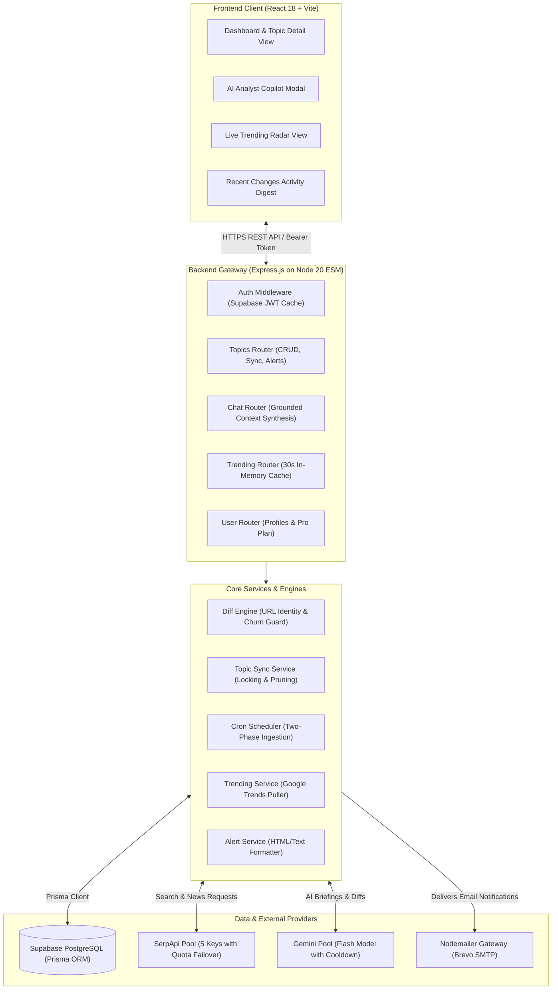
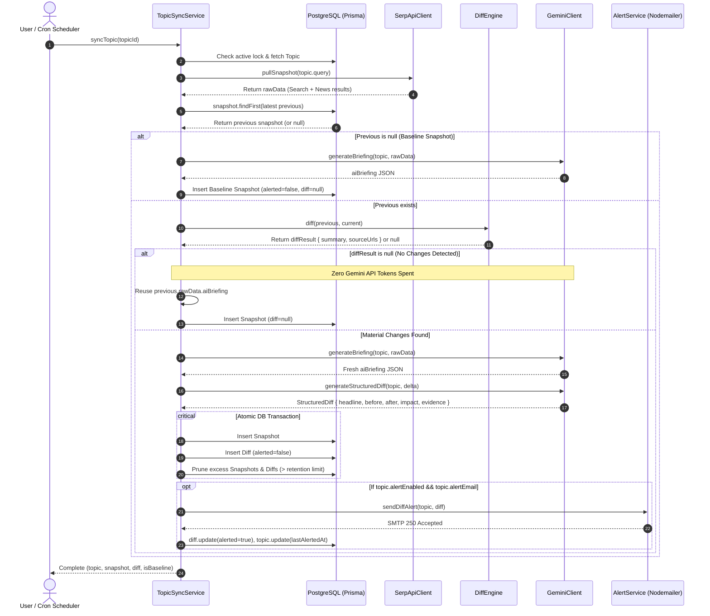
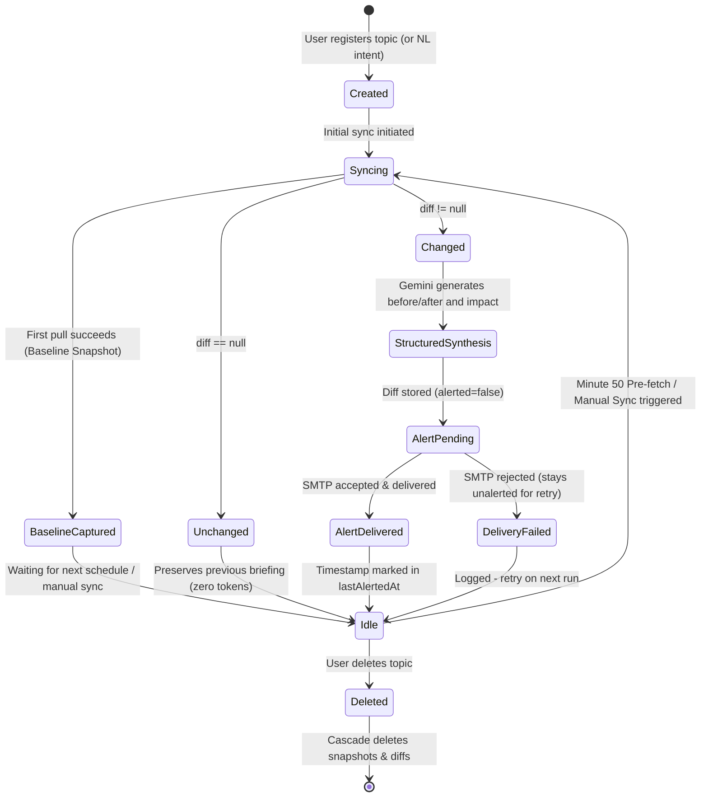
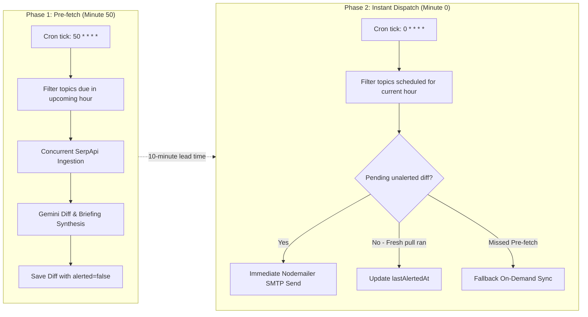
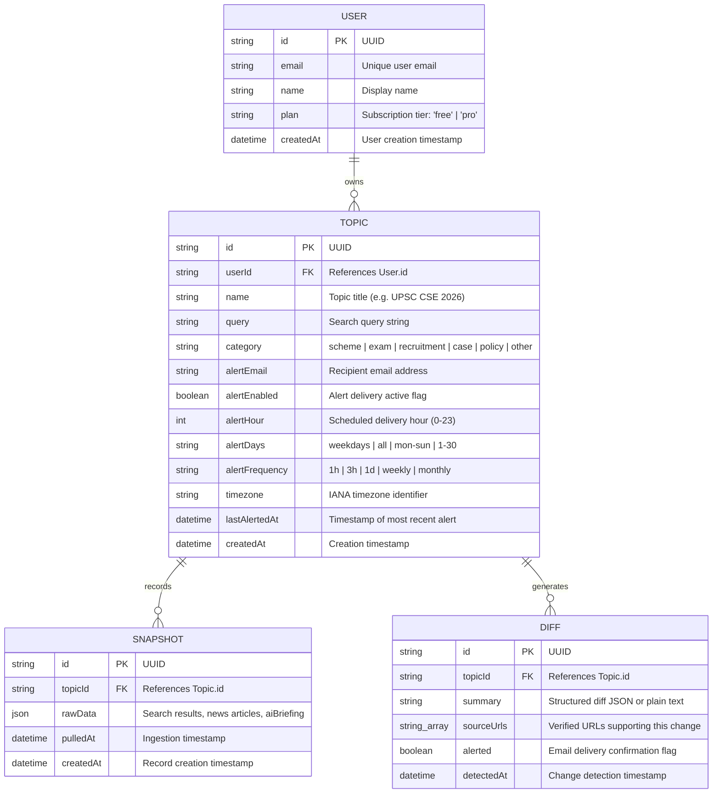

# Notice Me — Architecture & System Design

## 1. System Overview

Notice Me is a stateful change-monitoring agent designed to track critical regulatory circulars, government welfare schemes, recruitment notices, and judicial proceedings across India.

---

## 2. Ingestion & Diffing Sequence Flow

This sequence diagram illustrates the lifecycle of a single topic pull, whether triggered automatically by the background cron scheduler or manually by the user:

---

## 3. Topic & Snapshot Lifecycle State Machine

---

## 4. Two-Phase Cron Architecture

Notice Me splits scheduled alert operations into two discrete phases to prevent alert delay and network congestion:

---

## 5. Multi-Key Rotation Pools & Quota Recovery

### SerpApi Client (`scripts/serpapi-client.js`)
- Circular rotation over `SERPAPI_KEY_1` through `SERPAPI_KEY_5`.
- Intercepts HTTP 429 and rate-limit responses.
- Channels (Search vs News) retain successful key offsets to avoid thrashing.
- Redacts key secrets in logs (reports only key pool index).

### Gemini AI Client (`scripts/gemini-client.js`)
- Circular pool rotation over `GEMINI_API_KEYS` and `GEMINI_API_KEY_1..10`.
- Applies a **60-second cooldown** to exhausted keys before re-attempting.
- Offline rule-based fallbacks guarantee functionality even during total API quota outages.

---

## 6. Token & Performance Optimization Matrix

| Mechanism | Architecture | Resource Impact |
| --- | --- | --- |
| **Zero-Diff Briefing Reuse** | In `topicSyncService.js`, diff comparison executes *prior* to Gemini calls. Identical snapshots inherit previous briefing. | **~95% reduction** in Gemini API calls during cron cycles. |
| **Compact JSON Templates** | Stripped `null, 2` pretty-printing across all prompt definitions. | **~35% input token reduction** on every LLM call. |
| **Bounded Output Caps** | Bounded `maxOutputTokens` (600 for briefings, 750 for diffs, 1000 for chat). | Prevents run-away generation latency and quota consumption. |
| **Topic-Scoped Chat Context** | In `/api/topics/chat`, context filters strictly to target topic, limiting snapshots to top 3 and truncating snippets. | Shrinks chat prompt payload from **~12,000 to ~1,200 tokens**. |
| **Frontend Code Splitting** | Vite manual chunks (`vendor`, `supabase`) and `React.lazy` on pages and modals. | Initial JavaScript entry payload reduced from **519 kB to 4.87 kB**. |
| **In-Memory Follower Cache** | 30s cache with `Cache-Control: public, max-age=15` on `/api/topics/trending`. | Eliminates redundant database reads on the public trending feed. |

---

## 7. Database Entity Relationship (ER) Model

### Data Retention & Cleanup Policies
- **Snapshot Retention Limit:** Configured via `SNAPSHOT_RETENTION_LIMIT` (default: 20 per topic). Excess rows are automatically pruned inside the atomic write transaction.
- **Diff Retention Limit:** Configured via `DIFF_RETENTION_LIMIT` (default: 50 per topic). Excess rows are pruned to prevent database bloat.
- **User Cascade Deletion:** When a Topic is deleted, all associated Snapshots and Diffs are deleted within a serializable transaction.
