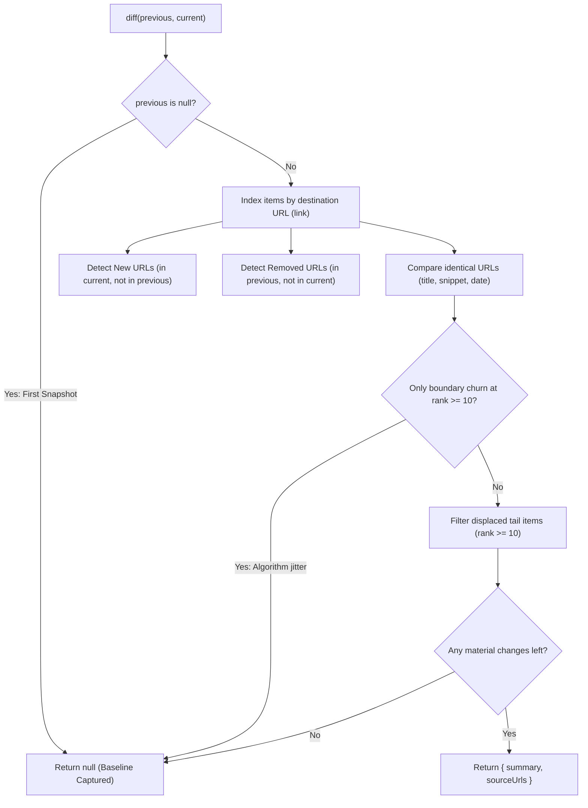
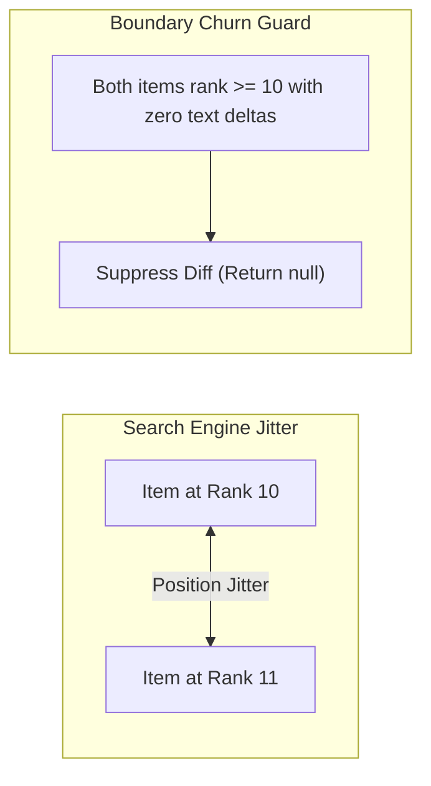
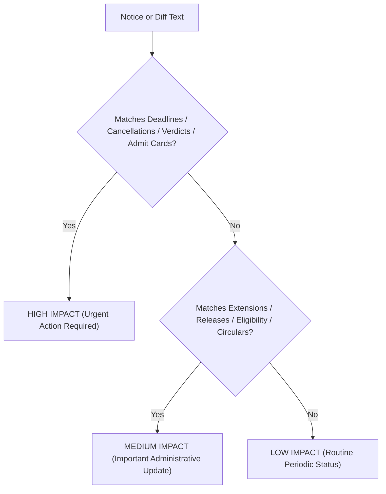

# Notice Me — Diff Engine Rules & Delta Specification

## Overview

Notice Me is a stateful change-monitoring agent. Unlike search engines and chatbots that retrieve data once and immediately forget, Notice Me tracks changes over time by comparing periodic search and news snapshots against their last known state.

The Diff Engine (`scripts/diff-engine.js`) evaluates two snapshots—`previous` and `current`—and extracts only **material, actionable updates** while discarding search engine ranking noise.

---

## Diff Decision Pipeline



---

## Identity Model

- **Canonical Identifier:** Each search or news result is uniquely identified by its destination URL (`link`).
- The diff engine builds a lookup index of all items by trimmed link URL.
- Items appearing across both `search` and `news` collections within a snapshot are evaluated against prior entries having the same URL.

---

## What Counts as a Meaningful Change

A diff is recorded (`{ summary, sourceUrls }`) when any of the following occur:

### 1. New Result Discovered
- **Condition:** A URL exists in the current snapshot that did not exist in the previous snapshot.
- **Plain Language Summary:** `New result: <title>`
- **Citation:** The new URL is appended to `sourceUrls`.

### 2. Removed Result
- **Condition:** A URL that was present in the previous snapshot no longer appears in the top results of the current snapshot (and was not simply displaced by an insertion at rank 10).
- **Plain Language Summary:** `Removed result: <title>`
- **Citation:** The removed URL is appended to `sourceUrls`.

### 3. Changed Content on an Existing Link
When a URL persists between snapshots, the engine compares its textual content and metadata:

- **Changed Snippet:**
  - **Condition:** The snippet text returned by SerpApi changes (e.g., revised eligibility limits, fee updates, application instructions).
  - **Plain Language Summary:** `Changed on <site>: <old_snippet> → <new_snippet>`
- **Changed Title:**
  - **Condition:** The page headline or notice title is revised (e.g., draft notice updated to official release).
  - **Plain Language Summary:** `Changed title on <site>: "<old_title>" → "<new_title>"`
- **Changed Date:**
  - **Condition:** The publication or indexing date string changes.
  - **Plain Language Summary:** `Changed date on <site>: <old_date> → <new_date>`
- **Citation:** The modified link URL is appended to `sourceUrls`.

Where `<site>` is extracted from the publisher source name if available (e.g., "The Hindu"), or the clean domain hostname (e.g., "pmkisan.gov.in").

---

## Noise Filtering & False-Positive Guards



1. **Rank Position Reordering:**
   - If position 1 and position 2 swap ranks but their URLs, titles, snippets, and dates remain identical, the diff engine treats this as **no change** and returns `null`.

2. **Boundary Rank Churn Guard (Rank >= 10):**
   - When result sets reach max window size (>= 10 items), items at the bottom edge frequently bounce between rank 10 and 11 due to algorithmic search jitter.
   - If the *only* difference across full windows is a bottom-boundary swap with zero modifications elsewhere, the engine suppresses the false-positive diff.

3. **Displaced Tail Removal Filtering:**
   - If a new breaking item enters at rank 1–9, the 10th item is pushed to rank 11. The engine recognizes this displacement and avoids reporting the displaced 10th item as "Removed" if higher-rank additions caused the shift.

4. **First Snapshot Baseline:**
   - When a topic is first tracked, `previous` is `null`. The diff engine returns `null` because this first pull establishes the baseline.

5. **Whitespace & Formatting Normalization:**
   - Whitespace and punctuation variations are trimmed before comparison to prevent false positives.

---

## Impact Classification Matrix (`classifyImpact`)

The diff engine exports a unified impact classifier used across alerts and AI briefings:



```javascript
export function classifyImpact(text): 'HIGH' | 'MEDIUM' | 'LOW'
```

---

## AI Structured Diff Synthesis

When Gemini is active, `generateStructuredDiff` enhances the raw diff output into a structured intelligence document:

```typescript
type StructuredDiff = {
  headline: string;        // E.g. "Application deadline extended by 7 days"
  explanation: string;     // 1-2 crisp executive sentences
  before: string | null;   // Previous state/date
  after: string | null;    // Updated state/date
  whyItMatters: string;    // Practical significance for citizen/applicant
  whoIsAffected: string | null; // Impacted target group
  actionRequired: string | null; // Next steps
  impact: 'HIGH' | 'MEDIUM' | 'LOW';
  whyAmISeeingThis: string[];   // Grounding rationale
  evidence: Array<{
    title: string;
    url: string;
    domain: string;
    sourceType: 'Official Portal' | 'News Bulletin' | 'Web Source';
    date: string | null;
    excerpt: string;
  }>;
};
```
