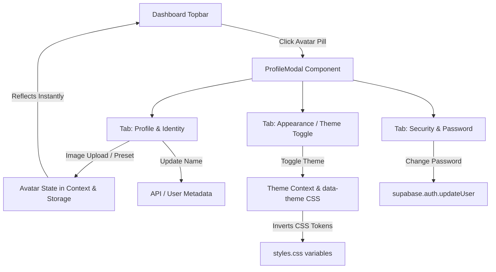

# Design Specification: Profile & Settings Modal with Theme Toggle

**Date:** 2026-10-01  
**Target:** Frontend Profile & Settings System (`Notice_Me`)  
**Status:** Approved by User  

---

## 1. Problem Statement & Goals
- **Topbar Privacy:** Currently, the dashboard topbar displays the full email address (e.g. `prathvikmehra2@gm...`) inside the user profile badge. The user requested removing the email display from the topbar and showing only a sleek, circular avatar (custom profile image, avatar preset, or name/email initial).
- **Profile Modal:** Clicking the avatar opens a dedicated Neo-Brutalist Profile & Settings modal.
- **Key Features in Profile Modal:**
  1. **Identity & Avatar Customization:**
     - Upload custom avatar photo (instant client-side preview and compression, saved to user profile metadata/localStorage).
     - Preset Neo-Brutalist avatar icons (e.g. Radar 👁️, Gazette 📰, Spark ⚡, Owl 🦉, Scholar 🎓, Shield 🛡️).
     - Editable Display Name.
     - Account info (Email displayed safely with a verified badge, Plan tier Free/Pro, Tracked topics count).
  2. **Theme Toggle (Light / Dark Mode):**
     - Full dark theme styling using Notice Me's Neo-Brutalist design language.
     - Instant toggle between "Sunlit Gazette" (Light) and "Midnight Radar" (Dark).
     - Persists choice across reloads via `localStorage` and `data-theme="dark"` attribute on `<html>`.
  3. **Security:**
     - Change Password form (New Password & Confirm Password with validation).
     - Integration with `supabase.auth.updateUser` (with clear success feedback and demo mode compatibility).

---

## 2. Component Architecture & Data Flow

---

## 3. UI/UX Design

### Topbar Profile Pill
- Replaces `
...
` with `<button className="topbar-avatar-btn">`.
- Displays a 36px circular avatar:
  - If custom image exists: ``
  - If no image: High-contrast circle showing first initial of name (or email).
- Bold black border (`2.5px solid var(--black)`), tactile hover shadow (`2px 2px 0px var(--black)`), and tooltip.
- Completely removes the exposed email text from the topbar.

### Profile Modal Layout
- Matches `DossierModal` and `ProModal` design:
  - Deep backdrop overlay with backdrop blur.
  - Neo-Brutalist window: thick border, solid offset shadow, tactile header badge, close button `✕`.
  - Navigation Tab Strip:
    - `[👤 Profile & Identity]`
    - `[🌓 Appearance]`
    - `[🔒 Security]`

### Theme Engine (`[data-theme="dark"]`)
- Inverts root CSS variables in `frontend/src/styles.css`:
  - `--bg: #0F1115`
  - `--bg-sidebar: #16181D`
  - `--white: #1C1F26`
  - `--black: #F8FAFC`
  - Accents (`--lime`, `--yellow`, `--cyan`, `--red`, `--lavender`) retain vibrant pop against dark brutalist backgrounds.
  - Borders and shadows dynamically adopt `var(--black)` (`#F8FAFC`).

---

## 4. Scope & Constraints
- Only frontend files are modified (`frontend/src/...`).
- No changes to git remote (`git push` will NOT be executed until explicitly requested).
- Retains 100% test compatibility.
